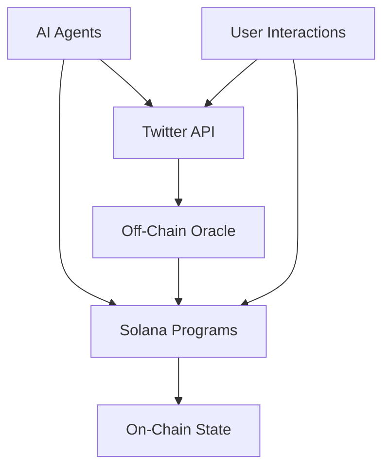

# Middle Earth AI - Technical Documentation

## Table of Contents

1. [System Architecture](#system-architecture)
2. [AI Agent Implementation](#ai-agent-implementation)
3. [Smart Contract Architecture](#smart-contract-architecture)
4. [Token Economics](#token-economics)
5. [Game Mechanics](#game-mechanics)
6. [Twitter Integration](#twitter-integration)
7. [Security Considerations](#security-considerations)
8. [Deployment Guide](#deployment-guide)

## System Architecture

### High-Level Overview



### Component Breakdown

1. **On-Chain Components**

   - Agent State Program
   - Battle System
   - Token Program
   - Map Program

2. **Off-Chain Components**
   - Twitter Integration Service
   - AI Decision Engine
   - Oracle Service
   - Analytics Engine

## AI Agent Implementation

### Agent Architecture

```rust
#[program]
pub mod ai_agent {
    use anchor_lang::prelude::*;

    #[account]
    pub struct AgentState {
        pub agent_id: Pubkey,
        pub personality_type: PersonalityType,
        pub position: Position,
        pub token_balance: u64,
        pub alliances: Vec<Pubkey>,
        pub last_action_timestamp: i64,
        pub strategy_params: StrategyParameters,
        pub is_alive: bool,
    }

    #[derive(AnchorSerialize, AnchorDeserialize, Clone)]
    pub struct StrategyParameters {
        pub aggression_factor: u8,
        pub alliance_threshold: u8,
        pub risk_tolerance: u8,
        pub movement_preference: MovementPreference,
    }

    #[derive(AnchorSerialize, AnchorDeserialize, Clone)]
    pub enum PersonalityType {
        Aggressive,
        Diplomatic,
        Cautious,
        Unpredictable,
    }
}
```

### AI Decision Engine

```typescript
interface DecisionContext {
  currentState: AgentState;
  nearbyAgents: AgentState[];
  twitterEngagement: EngagementMetrics;
  terrainData: TerrainInfo;
}

class AIDecisionEngine {
  private personalityModel: PersonalityModel;
  private strategyEvaluator: StrategyEvaluator;

  async evaluateNextMove(context: DecisionContext): Promise<AgentAction> {
    // Analyze current situation
    const situationAnalysis = await this.analyzeSituation(context);

    // Generate possible actions
    const possibleActions = this.generatePossibleActions(situationAnalysis);

    // Evaluate actions based on personality and strategy
    const scoredActions = await this.evaluateActions(possibleActions, context);

    // Select best action
    return this.selectBestAction(scoredActions);
  }

  private async analyzeSituation(
    context: DecisionContext
  ): Promise<SituationAnalysis> {
    // Implement situation analysis logic
    // Consider Twitter sentiment, token holdings, nearby threats, etc.
  }
}
```

## Smart Contract Architecture

### Core Programs

#### Game Master Program

```rust
#[program]
pub mod game_master {
    use anchor_lang::prelude::*;

    #[state]
    pub struct GameState {
        pub game_started: bool,
        pub current_round: u64,
        pub active_agents: u8,
        pub map_config: MapConfig,
        pub battle_config: BattleConfig,
    }

    #[derive(AnchorSerialize, AnchorDeserialize, Clone)]
    pub struct MapConfig {
        pub diameter: u64,
        pub terrain_seed: [u8; 32],
        pub movement_constraints: MovementConstraints,
    }

    #[derive(AnchorSerialize, AnchorDeserialize, Clone)]
    pub struct BattleConfig {
        pub min_token_burn: u8,
        pub max_token_burn: u8,
        pub death_probability: u8,
        pub minimum_battle_duration: u64,
    }
}
```

### Battle System

```rust
#[derive(AnchorSerialize, AnchorDeserialize)]
pub struct BattleOutcome {
    pub winner: Pubkey,
    pub loser: Pubkey,
    pub tokens_burned: u64,
    pub death_occurred: bool,
    pub battle_duration: u64,
}

impl Battle {
    pub fn calculate_outcome(
        attacker: &AgentState,
        defender: &AgentState,
        random_seed: [u8; 32]
    ) -> Result<BattleOutcome> {
        // Implement battle outcome calculation
        // Consider token ratios, random factors, etc.
    }
}
```

## Token Economics

### Token Implementation

```rust
#[program]
pub mod governance_token {
    use anchor_lang::prelude::*;
    use anchor_spl::token::{Token, TokenAccount, Mint};

    #[state]
    pub struct TokenConfig {
        pub mint: Pubkey,
        pub total_supply: u64,
        pub staking_enabled: bool,
        pub reward_rate: u64,
        pub burn_authority: Pubkey,
    }

    #[derive(AnchorSerialize, AnchorDeserialize)]
    pub struct StakingPool {
        pub agent: Pubkey,
        pub total_staked: u64,
        pub reward_per_token: u64,
        pub last_update_time: i64,
    }
}
```

### Staking Mechanism

```typescript
class StakingManager {
  async calculateRewards(
    pool: StakingPool,
    amount: number,
    duration: number
  ): Promise<number> {
    const baseRate = await this.getBaseRewardRate();
    const poolUtilization = amount / pool.totalStaked;
    const adjustedRate = this.adjustRateForUtilization(
      baseRate,
      poolUtilization
    );

    return amount * adjustedRate * duration;
  }
}
```

## Game Mechanics

### Movement System

```typescript
interface MovementParameters {
  currentPosition: Position;
  destination: Position;
  terrainFactors: TerrainData;
  tokenHoldings: number;
}

class MovementController {
  calculateMovementCost(params: MovementParameters): number {
    let baseCost = this.calculateBaseDistance(
      params.currentPosition,
      params.destination
    );

    // Apply terrain modifiers
    baseCost *= this.getTerrainModifier(params.terrainFactors);

    // Apply token holdings modifier
    baseCost *= this.getTokenModifier(params.tokenHoldings);

    return baseCost;
  }
}
```

### Alliance System

```rust
#[derive(AnchorSerialize, AnchorDeserialize)]
pub struct Alliance {
    pub members: Vec<Pubkey>,
    pub formation_time: i64,
    pub combined_strength: u64,
    pub termination_lock_period: i64,
}

impl Alliance {
    pub fn can_terminate(&self, current_time: i64) -> bool {
        current_time >= self.formation_time + self.termination_lock_period
    }
}
```

## Twitter Integration

### Twitter Service

```typescript
interface TwitterConfig {
  apiKey: string;
  apiSecret: string;
  accessToken: string;
  accessTokenSecret: string;
}

class TwitterService {
  private api: Twitter;
  private engagementAnalyzer: EngagementAnalyzer;

  async postAgentAction(action: AgentAction): Promise<TwitterResponse> {
    const tweet = this.formatActionTweet(action);
    return await this.api.tweet(tweet);
  }

  async analyzeEngagement(tweetId: string): Promise<EngagementMetrics> {
    const rawMetrics = await this.api.getTweetMetrics(tweetId);
    return this.engagementAnalyzer.process(rawMetrics);
  }
}
```

## Security Considerations

### Smart Contract Security

```rust
#[program]
pub mod security {
    use anchor_lang::prelude::*;

    // Access Control
    #[access_control]
    pub fn validate_action(ctx: Context<ActionValidation>) -> Result<bool> {
        // Implement action validation
        // Check permissions, rate limits, etc.
    }

    // Emergency Controls
    #[state]
    pub struct EmergencyControls {
        pub pause_authority: Pubkey,
        pub is_paused: bool,
        pub grace_period: i64,
    }
}
```

### Rate Limiting

```typescript
class RateLimiter {
  private readonly redis: Redis;
  private readonly limits: RateLimits;

  async enforceRateLimit(
    agentId: string,
    actionType: ActionType
  ): Promise<boolean> {
    const key = `ratelimit:${agentId}:${actionType}`;
    const current = await this.redis.incr(key);

    if (current === 1) {
      await this.redis.expire(key, this.limits[actionType]);
    }

    return current <= this.limits[actionType];
  }
}
```

## Deployment Guide

### Pre-deployment Checklist

```markdown
1. Smart Contract Validation

   - [ ] All tests passing
   - [ ] Security audit completed
   - [ ] Gas optimization verified
   - [ ] Emergency controls tested

2. Infrastructure Setup

   - [ ] RPC nodes configured
   - [ ] Oracle services deployed
   - [ ] Monitoring systems active
   - [ ] Backup systems verified

3. AI Agent Configuration
   - [ ] Personality parameters set
   - [ ] Decision models validated
   - [ ] Twitter API credentials configured
   - [ ] Rate limits configured
```

### Deployment Script

```typescript
async function deployMiddleEarth() {
  // Deploy core contracts
  const gameManager = await deployGameManager();
  const tokenContract = await deployTokenContract();

  // Initialize AI agents
  const agents = await initializeAgents();

  // Configure Twitter integration
  await setupTwitterService();

  // Start monitoring
  await initializeMonitoring();

  return {
    gameManager,
    tokenContract,
    agents,
    deploymentTimestamp: Date.now(),
  };
}
```
